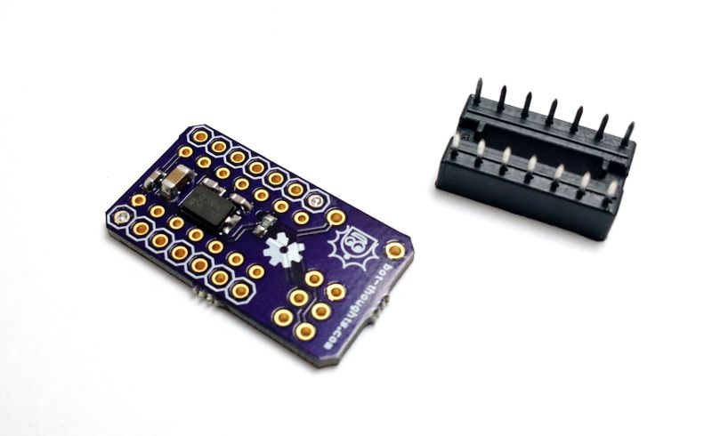

# eeZeeMedTiny
A breadboard breakout / target board for ATtiny84 family

The smallest breakout & target board for the 14-pin ATtiny84, including AVR ISP header, reset switch and pull-up resistor,
and bypass caps. Step up to an ATtiny84 for more power and 6 more pins.

Easy to breadboard, prototype and program ATtiny84 with eeZee Medium Tiny. 

[For sale on Tindie.com](https://www.tindie.com/products/bot_thoughts/attiny84-development-board/)

